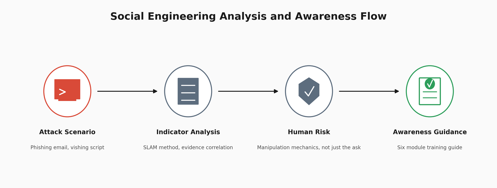

# Social Engineering Analysis and Security Awareness

Documenting how social engineering targets people rather than technical vulnerabilities. Five social engineering types broken down, two attack scenarios analysed, and a training guide written for the people who actually have to recognise them.



## At a Glance

| Field | Detail |
| --- | --- |
| Work Type | Social engineering analysis and awareness material |
| Attack Types Documented | 5 |
| Attacks Analysed | Spoofed PayPal phishing email, IT support vishing script |
| Deliverable | 6 module security awareness training guide |
| Target Layer | Human, email, phone, physical media, social media |
| Framework | MITRE ATT&CK where supported by documented behaviour |

## What This Is

Social engineering targets decisions, trust, urgency, and human behaviour rather than relying only on technical exploitation.

An employee who enters a password into a convincing phishing page has handed over valid credentials. Valid credentials can be harder to distinguish from legitimate access than a technical exploit.

Identity, proxy, DNS, email, and endpoint telemetry may still expose activity surrounding credential phishing, but preventing the initial interaction also depends on people recognising what they are being asked to do.

This project documents common social engineering techniques and translates the analysis into practical security awareness material for a non technical audience.

Scope stated plainly: this is analysis and awareness material, not a live phishing campaign against real users. No employees were tested.

## Attack Type Documentation

Five core social engineering types were documented with their red flags, detection methods, and defensive considerations.

The common thread is manipulation.

Urgency reduces the time someone has to think.

Authority makes questioning the request more difficult.

Fear can make compliance feel safer than verification.

Curiosity can encourage someone to interact with something they normally would not trust.

The analyst's job is therefore not only to recognise technical indicators. It is also to understand the behaviour the attacker is trying to create.

## Phishing Analysis, Spoofed PayPal

A phishing template impersonating PayPal was analysed using the SLAM method:

**Sender**

**Links**

**Attachments**

**Message**

Seven indicators were identified, including a spoofed sender domain, mismatched Reply-To, and urgency language.

The scenario was then broken down from the initial lure toward the intended credential harvesting outcome.

### Reply-To

The Reply-To differing from the displayed sender is useful evidence, but Reply-To is not inherently more trustworthy than From.

Both are header fields controlled by the sender.

What makes the mismatch useful is the relationship it exposes between the identity presented to the recipient and the infrastructure intended to receive a response.

The verdict therefore rests on the combination of indicators rather than treating one header field as impossible to spoof.

### Urgency

The urgency is part of the attack mechanism.

A deadline such as "24 hours" attempts to reduce the time available for independent verification.

The useful question is not simply whether the message sounds urgent.

It is:

**What action is the urgency trying to make the recipient perform before they verify the request?**

### Email Authentication

Missing SPF and DKIM is supporting evidence toward forgery, not proof by itself.

Authentication results need to be interpreted alongside the sender domain, Reply-To, message content, links, and other available evidence.

A legitimate sender can also have incomplete or poorly configured email authentication.

The phishing verdict therefore comes from correlation between indicators rather than one failed check.

## Vishing Analysis, Fake IT Support Call

A vishing script impersonating IT support was analysed.

Five indicators were identified, including:

* An unsolicited support call
* A request for credentials
* Pressure to act quickly
* Authority based impersonation
* An attempt to obtain an OTP

One operational rule carries this section:

**Never disclose an OTP to an unsolicited caller, regardless of who they claim to be.**

That is a defensive rule, not a claim that every OTP request universally proves an active account takeover.

The important analytical distinction is between recognising dangerous behaviour and overstating what a single indicator proves.

### Why Vishing Is Different

A phishing email can leave headers, domains, URLs, IP addresses, and other artefacts that an analyst can inspect.

A phone call by itself may leave considerably less.

Depending on the environment, supporting evidence can still exist through call logs, help desk records, identity provider events, authentication activity, or subsequent account behaviour.

This makes prevention and verification especially important.

### Callback Verification

Independent callback verification can break the attacker's immediate pretext.

The user should end the inbound call and contact the organisation through a number obtained from a trusted source rather than one supplied by the caller.

Sensitive actions should not proceed solely because an inbound caller appears knowledgeable or authoritative.

## Awareness Training Guide

A six module security awareness guide was produced for a non technical audience.

### Module 1

Six golden rules of security.

### Module 2

The SLAM method for spotting phishing.

### Module 3

Phone call verification protocol.

### Module 4

Four realistic scenarios with the correct response to each.

### Module 5

Incident reporting procedure.

### Module 6

Quick reference card.

Scenario based training is particularly useful because people may remember a situation more easily than a formal definition.

Someone might forget the definition of pretexting but recognise a caller creating urgency while pretending to be IT support.

The reporting process matters for the same reason.

Recognising something suspicious only helps the wider organisation if the person knows what to do next.

A clear reporting path reduces hesitation and gives the security team an opportunity to investigate the activity and protect other users.

Writing security material for people who do not work in security is therefore its own security skill.

Technical accuracy matters, but so does making the guidance understandable enough to use.

## MITRE ATT&CK Context

This project analyses social engineering tradecraft rather than documenting an observed intrusion.

ATT&CK mappings should therefore describe behaviour actually demonstrated in the written scenarios rather than techniques that merely sound related.

### T1566, Phishing

Phishing is relevant to the documented email scenario because the scenario uses deceptive communication to influence the recipient into performing an action.

A more specific subtechnique such as **T1566.002 Spearphishing Link** should only be used when the underlying analysed material confirms that a malicious link was part of the scenario.

### Mappings Not Claimed

**T1036.005, Match Legitimate Resource Name or Location**

Not used for the spoofed PayPal sender. Brand impersonation in an email does not by itself demonstrate this subtechnique.

**T1091, Replication Through Removable Media**

Not used for USB baiting alone. T1091 describes malware replication through removable media rather than the human deception used to persuade someone to connect the media.

**T1583.001, Domains**

Not claimed solely because a suspicious or malicious domain appears in a scenario. The project would need evidence supporting adversary acquisition of infrastructure before making that mapping.

**T1056.003, Web Portal Capture**

Not claimed unless the analysed evidence includes the credential harvesting portal itself rather than only an email or URL leading toward it.

**T1598, Phishing for Information**

Not claimed for the phone based vishing scenario without stronger evidence that the documented behaviour fits the technique definition.

The goal is not to maximise the number of ATT&CK IDs attached to the project.

The goal is to map only what the documented behaviour supports.

## Analyst Findings

Five social engineering types were documented with red flags and defensive considerations.

The phishing template was assessed using seven indicators, including the spoofed domain, mismatched Reply-To, and urgency language.

The phishing verdict rests on the combination of indicators rather than one supposedly definitive header field.

The vishing script was assessed as a credential and OTP harvesting scenario based on its request pattern and manipulation techniques.

A six module awareness guide was produced to translate the analysis into practical defensive behaviour.

The project demonstrates that human focused attacks require both technical controls and clear verification and reporting procedures.

## Recommended Response

Enforce SPF, DKIM, and DMARC as part of the email security layer.

Use secure email filtering and identity controls alongside user awareness rather than expecting recipients to identify every malicious message themselves.

Adopt an independent callback verification procedure for inbound IT support calls involving credentials, account changes, MFA, or other sensitive actions.

Never verify an inbound caller using contact information supplied by that caller.

Make suspicious email reporting simple and clearly documented.

Encourage reporting even when the employee is uncertain. A false alarm can be investigated. An unreported attack cannot.

Use scenario based awareness exercises that teach people what suspicious situations actually look and feel like.

Feed confirmed phishing reports back into technical controls where appropriate so employee reporting becomes another source of defensive information.

## What This Lab Demonstrates

* Documenting social engineering tradecraft and its behavioural indicators.
* Applying the SLAM method to a phishing scenario.
* Reaching a phishing verdict through correlation rather than one indicator.
* Separating useful evidence from claims that individual email headers prove too much.
* Analysing a vishing script for manipulation and credential harvesting behaviour.
* Understanding why phone based attacks can provide fewer immediately searchable artefacts than email.
* Translating technical security reasoning into guidance for a non technical audience.
* Designing practical verification and reporting procedures.
* Applying MITRE ATT&CK conservatively rather than forcing a technique onto every behaviour.

## Lessons Learned

The strongest lesson from this project was that social engineering analysis still requires evidence discipline.

It is easy to turn a useful indicator into an absolute rule.

A mismatched Reply-To can strengthen a phishing assessment, but the field itself is still controlled by the sender.

Missing SPF or DKIM can increase suspicion, but it does not independently prove forgery.

An OTP request during an unsolicited support call is enough to justify refusing the request, but the defensive action and the analytical conclusion are different things.

That distinction matters.

Security awareness material has to simplify security without making the underlying claims inaccurate.

I also learned that writing for a non technical audience changes the way security information needs to be presented.

Definitions are useful, but situations, verification steps, and clear actions are easier to apply when someone is under pressure.

## What I Would Improve

I would validate the awareness material with people outside cybersecurity to see which explanations are immediately understandable and which still rely on technical knowledge.

I would expand the phishing analysis with complete email authentication results and additional header evidence so the assessment can demonstrate more of the verification process rather than relying primarily on the written scenario.

I would also separate the vishing analysis into its own report if the project grows further. That would make the phone based investigation easier to review independently from the phishing analysis.

Finally, I would turn the awareness guide into a small scenario based exercise where participants choose a response and then see why that response is safe or unsafe.

That would test whether the material can be applied rather than only read.

## Repository Structure

```text
.
├── README.md
├── reports/
│   ├── attack_types.md
│   ├── phishing_analysis.md
│   └── security_awareness_training.md
└── screenshots/
    └── 00_architecture.png
```

---

## Author

William Gokah

SOC Analyst Portfolio

[](https://linkedin.com/in/WilliamInCyber) [](https://x.com/WilliamInCyber)
